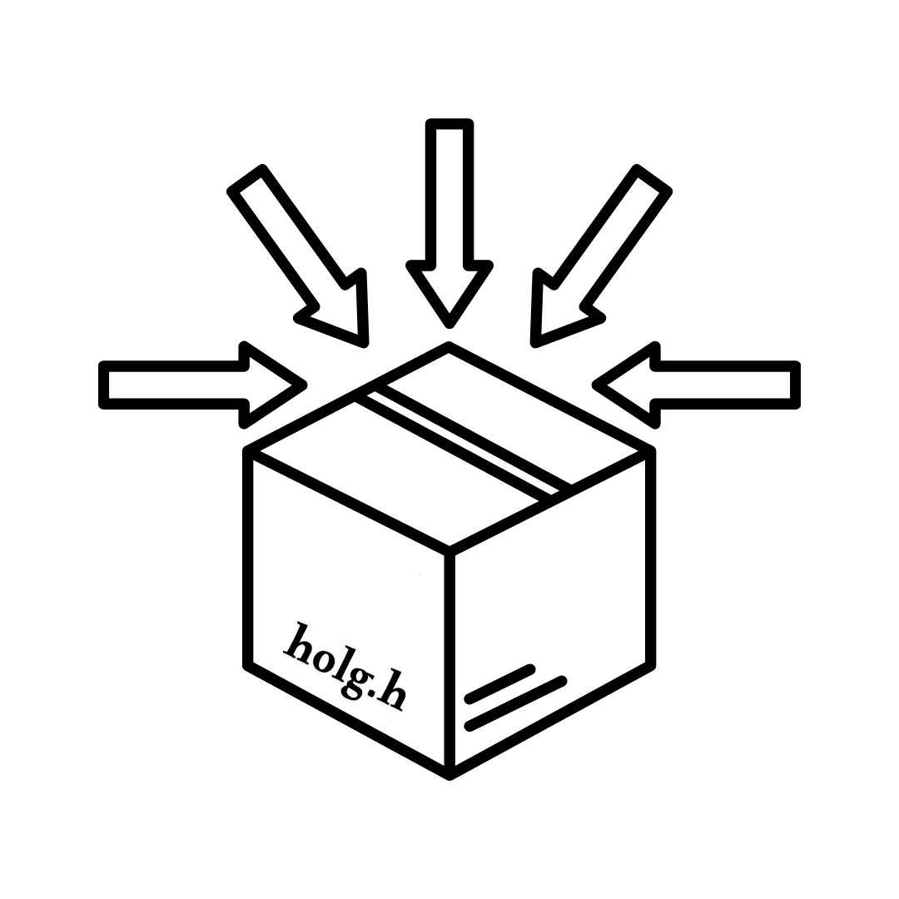

<p align="center">
  
</p>

<h1 align="center">HOLG</h1>

<p align="center">
A command-line tool that collects your headers and sources into a single header-only C/C++ library. It deduplicates includes, strips redundant guards, and ensures C++ compatibility by wrapping implementations with extern "C" when needed.</br>
  Part of the <a href="https://github.com/mesiel-org">Mesiel Project</a>.
</p>

<p align="center">
  <a href="https://github.com/mesiel-org/holg/actions/workflows/ci.yml"></a>
  <a href="https://github.com/mesiel-org/holg/releases"></a>
</p>


## Installation

You can download the pre-built binary from github releases [page](https://github.com/mesiel-org/holg/releases).

### Script (Recommended)

```bash
curl -L https://raw.githubusercontent.com/mesiel-org/holg/main/scripts/install.sh | bash
```

### Manual

```bash
git clone https://github.com/mesiel-org/holg.git
cd holg
cargo build --release
```

after build the binary will be available at: `target/release/holg`


## Usage

```bash
Usage: holg [OPTIONS] <input-paths>...

Options:
  -o, --out <FILE>       Output header file (default: holg.h)
  -i, --impl <MACRO>     Implementation macro guard (default: MESIEL_HOLG)
  -h, --help             Show this help message and exit
  -v, --version          Show version information

Description:
  HOLG collects your headers and sources into a single header-only C/C++ library.
  It deduplicates includes, strips redundant guards, and ensures C++ compatibility
  by wrapping implementations with extern "C" when needed.

Examples:
  holg -o mylib.h -i MYLIB .
  holg -o mylib.h -i MYLIB ./src
```


### Example

```bash
holg src/include src/lib -o combined.h -i MY_HEADER
```

## License
This software is licensed under the [MGL-v1 or later](LICENSE).
